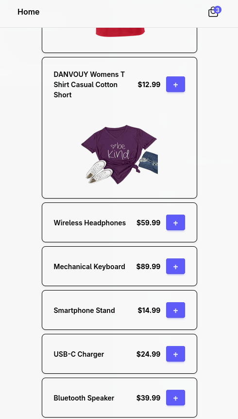
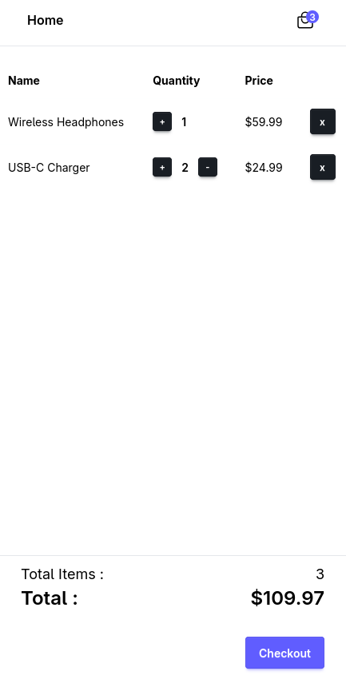
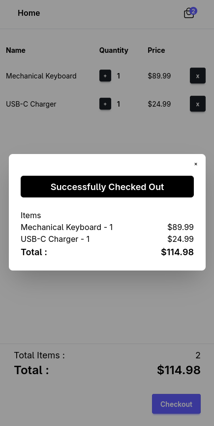
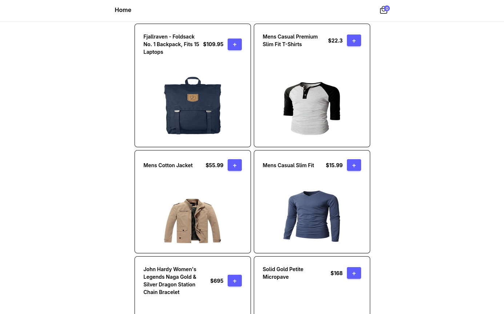
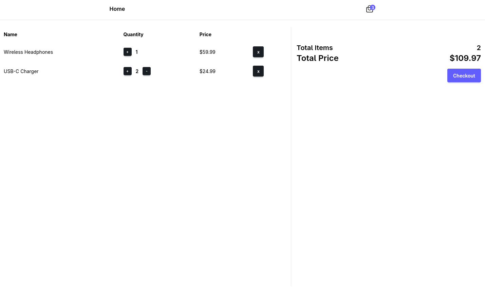

- Quick Demo of the project
- Product page
     - API Integration
     - Products from DB (mysql)
- Cart page
- DB persistence
- Reponsive

### Frontend:
- React
- Tailwind CSS
- React / Tanstack Query
     - trigger get requests on mutation success, smooth refetching

### Backend:
- Express
- Prisma
     - Models
        - Product
        - User
        - CartItem
        - Receipt
- MySQL
     - docker 

### Routes
### User
- /api/user/:id

### Cart
- /api/cart/ - `DELETE` - delete single item from cart
- /api/cart/:id - `POST` - add item to cart of user
- /api/cart/:id - `PATCH` - update quantity of item in cart

### Checkout
- /api/checkout/ - `POST` - create receipt\
- /api/checkout/:userId - `DELETE` - delete all items from cart of user

### Receipt
- /api/receipt/:userId - `GET` - get receipt of user
